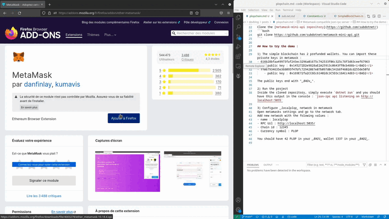

# Metamask compatible json-rpc server

This project is a proof of concept - It implements the minimum required ethereum rpc apis to be able to accept simple metamask transactions (transfert only).

This will be included in sub.net library.

## Prerequisites : 
You need [dotnet 7 sdk](https://dotnet.microsoft.com/en-us/download/dotnet/7.0) to build the project

Metamask extension depending on your browser :
- [chrome web store](https://chrome.google.com/webstore/detail/metamask/nkbihfbeogaeaoehlefnkodbefgpgknn)
- [firefox addons](https://addons.mozilla.org/fr/firefox/addon/ether-metamask/)

Clone the [metamask-mini-api repository](https://github.com/subdotnet/)
```bash
git clone https://github.com/subdotnet/metamask-mini-api.git
```

## How to try the demo : 

1) The simple blockchain has 2 prefunded wallets. You can import these private keys in metamask : 
- 616b28bfaa49973faf243ec3296a01675c742533f06c325c78f3d63ceef67963  
    - public key : 0x145272D2e9828aE2A25913c0643ff0cb486b<i>BAD1</i>
- ff067934635e368095f47bfc72942087e07b097d0c541b8f4602dcd255de50fd
    - public key : 0x169E72fa2CC6Ec61402dc3C5D3c16ACc4d83<i>BAD2</i>

The public keys end with "_BADx_".

_intall metamask and import prefunded dev addresses :_


2) Run the project
Inside the cloned repository, simply execute `dotnet run` and you should have this output in the console : `json-rpc api listening on http://localhost:5035`

3) Configure _localplop_ network in metamask
Open metamasks settings and go to the network tab.
Add new network with the folowing values :
- name : localplop
- RPC Url : http://localhost:5035/
- Chain id : 12345
- Currency symbol : PLOP

You should have 42 PLOP in your _BAD1_ wallet 1337 in your _BAD2_.

_Configure custom network in metamask and transfer funds:_


