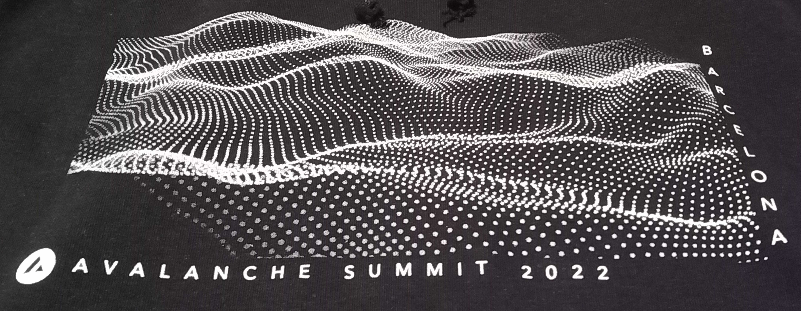

[Subdotnet](https://github.com/boulix3/subdotnet) 

_A Custom avalanche subnet VM written in C#_

## How it all started

This project was my submission for the Avalanche Summit Hackathon in Barcelona.
My goal was to implement a simple blockchain subnet. 

Unfortunately my project was incomplete. 

Here is what I managed to implement :  
- go-plugin c# implementation
- vm.proto empty-shell implementation (writes logs only)
- scripts to : publish subdotnet as a binary, and 

But most of all, during the hackathon I learned : 
- to read and understand golang
- about [avalanchego](https://github.com/ava-labs/avalanchego) internals
- how to run nodes locally using [avalanche-network-runner](https://github.com/ava-labs/avalanche-network-runner)
- how to register and run a custom subnet

## Where it's going

Provide a set of tooling simple way to create a subnet with custom rules built-in the blockchain.
- Nuget package
- Command line interface as a dotnet-tool 
- Developpement environment specifications
